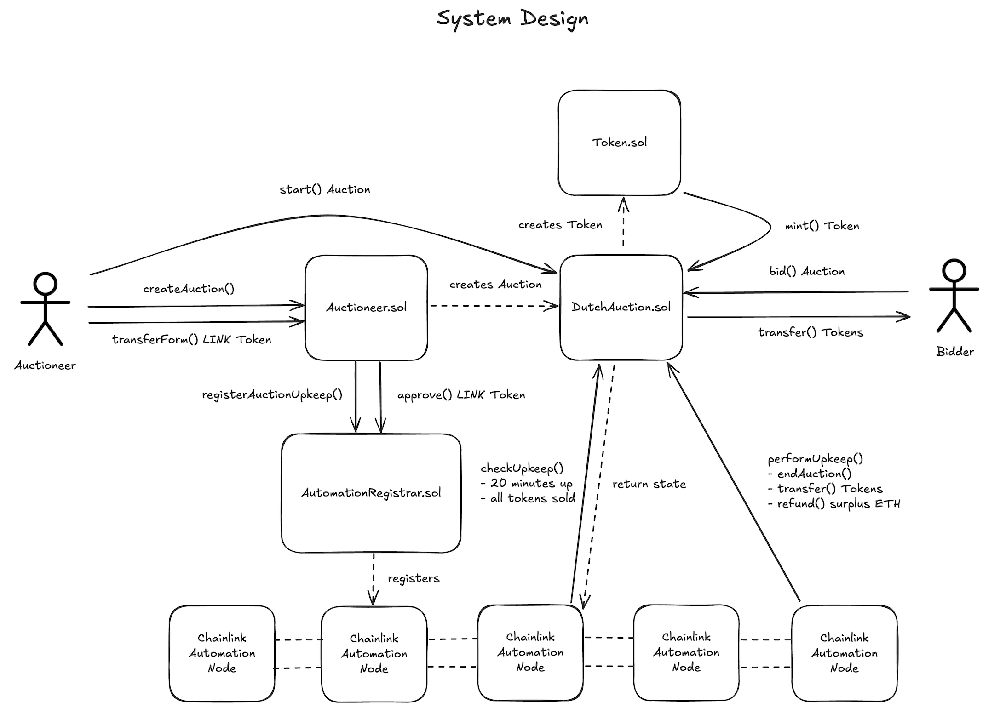

## Dutch Auction for Token ICOs dApp built on Base Sepolia, powered by Chainlink Automation.

## System Design



## Features

- Built on [Base Sepolia](https://www.base.org/).
- Used [Reown AppKit](https://reown.com/) + [Wagmi](https://wagmi.sh/) + [Viem](https://viem.sh/).
- [Dutch Auction for Token ICOs](https://github.com/INEX-EX/DApp-Test) - Resolves when token price reaches reserve price or when all tokens are sold. Auctions will only be open for 20 minutes.
- [Chainlink Automation](https://chain.link/) - Automate the auction process to end when token price reaches reserve price or when all tokens are sold. The automation will then airdrop the tokens to the bidders.

## Prerequisites

- [Metamask Wallet](https://metamask.io/)
- [Base Sepolia ETH](https://faucets.chain.link/)
- [LINK Tokens](https://faucets.chain.link/) (For creating of Auction)

## Getting Started

```bash
npm install
```

```bash
npm run dev
```

### For Auctioneers

#### Create Auction
1. Click on `Create Auction` Button
2. Approve 1 `LINK` Token
3. Confirm Auction Creation

#### Start Auction
1. Click on `Start` Button

### For Bidders

#### Bid Auction
1. Click on `Place Bid` Button
2. Enter the amount of `ETH` you wish to commit (Ensure you have enough ETH in your wallet)
3. Confirm Bid

## Deployments

- Auctioneer: [0x6b08b0b3f272108620d9b01242c927e112a99e51](https://sepolia.basescan.org/address/0x6b08b0b3f272108620d9b01242c927e112a99e51)

## Contracts

- Auctioneer.sol: Factory contract for creating and managing Dutch auctions
- DutchAuction.sol: A Dutch auction contract for token ICOs (similar to Liquidity Bootstrapping Pools)
- Token.sol: An ERC20 token contract for the auction


